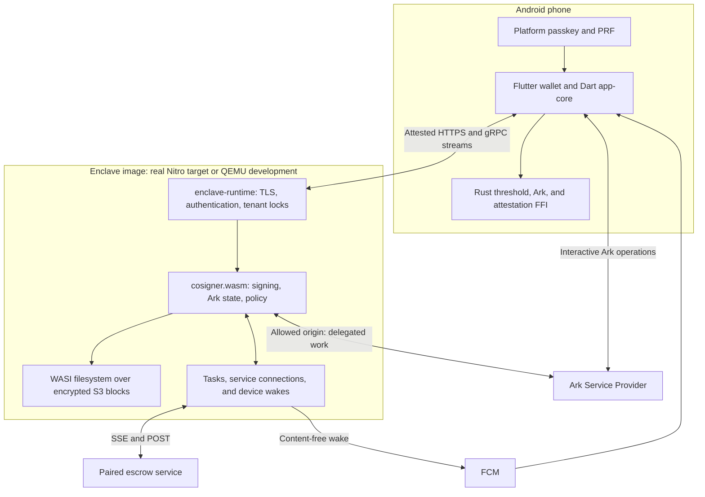

# Merlin Wallet

**A passkey-based Bitcoin wallet with a Wasm cosigner: approve on your phone, verify the service you are trusting, and let previously authorized work continue while you are offline.**

Merlin holds Bitcoin as **Ark off-chain VTXOs**. Ordinary wallet signing uses a **2-of-2 FROST key** shared between the phone and a remote cosigner. The phone reconstructs its signing share for each operation from its passkey and the cosigner's stored contribution, rather than keeping a FROST share in the application's persistent state.

The cosigner is a Rust component running on [**enclave-runtime**](https://github.com/BitspendPayment/enclave-runtime). The runtime supplies attested HTTPS, passkey authorization, tenant-scoped encrypted storage, background scheduling, maintained connections, and device wake notifications. Merlin supplies the wallet protocol, signing rules, Ark integration, and application policy.

That division supports more than interactive payments. A user can sign a bounded renewal delegate while present, then let the cosigner execute it with an Ark Service Provider (ASP) later. An explicitly paired escrow service can also initiate a policy-checked exchange through a connection the runtime maintains.

> **Development software; use test funds.** The documented local and MutinyNet environments use QEMU's emulated Nitro device and a development storage key. They exercise the integration but do not provide AWS Nitro's hardware trust boundary. Real Nitro deployment, independent security review, and resolution of wallet/runtime correctness findings remain prerequisites for production use.

## Contents

- [What Merlin implements](#what-merlin-implements)
- [Architecture](#architecture)
- [How Merlin uses enclave-runtime](#how-merlin-uses-enclave-runtime)
- [A concrete demonstration: renew while the phone is offline](#a-concrete-demonstration-renew-while-the-phone-is-offline)
- [Attestation, authorization, and isolation](#attestation-authorization-and-isolation)
- [Build and run](#build-and-run)
- [Testing](#testing)
- [Repository guide](#repository-guide)
- [Security model summary](#security-model-summary)
- [No key at rest](#no-key-at-rest)
- [Trust assumptions & failure modes](#trust-assumptions--failure-modes)
- [Emergency exit](#emergency-exit)

## What Merlin implements

| Capability | What is in the repository |
|---|---|
| **Threshold wallet creation** | A distributed key-generation ceremony and FROST signing over secp256k1, with Taproot/BIP-340-compatible signatures. The protocol uses shares rather than reconstructing the full group private key. |
| **Passkey-based signing and restoration** | A passkey PRF derives the phone's contribution; an approved cosigner stream returns the complementary dealt contribution. The reconstructed share is checked against the wallet's expected verifying share. |
| **Ark payments** | Boarding deposits, VTXO discovery, sends, settlement, history, and renewed-fund tracking through an ASP. |
| **Delegated renewal** | The user signs a delegate over a known set of funds; a durable runtime task attempts that renewal when due. Completion or inability to renew can wake the owner. |
| **Policy-controlled escrows** | Escrow creation, service pairing, release checks, allowance/reference tracking, and replies over runtime-held service connections. |
| **Pre-signed exits** | Exit transaction construction and verification, coverage tracking, export, and ancestry display. The app does not yet broadcast the complete ancestor/exit chain. |
| **An attested native client** | Nonce-bound verification of runtime/guest measurements and the connection certificate before an approved gRPC interaction is sent. |
| **Development and integration tooling** | Android app, shared Dart core, regtest CLI, Rust/FFI tests, QEMU end-to-end tests, and a MutinyNet deployment runbook. |

These are implementation capabilities, not a claim that every environment is validated or every finding is closed. The [security findings](SECURITY_FINDINGS.md) track known concerns, including cross-device PRF behavior, secret lifetimes, and test coverage. Some older assessments still refer to components that have since been replaced; current source and the test entry points below describe the active architecture.

## Architecture



| Participant | Responsibility |
|---|---|
| **Phone** | User interaction, passkey approval/PRF, share reconstruction, its side of FROST, and interactive Ark orchestration. |
| **Cosigner guest** | Its signing share, persistent wallet state, validation of signing requests, delegates, escrows, and application-level replay/accounting rules. |
| **enclave-runtime** | Component execution, measured boot, key release, TLS, tenant identity and filesystem scope, serialization, and the host capabilities the guest calls. |
| **ASP** | Ark rounds, indexing, settlement, and the external service needed for normal Ark operations. |
| **Paired service** | An explicitly configured counterparty for an escrow, subject to that escrow's policy. It does not receive the user's passkey or general wallet authority. |

The current server artifact is [`cosigner.wasm`](cosigner/src/main.rs), built for `wasm32-wasip2`. It exports `wasi:http/incoming-handler`, `run-task`, and `on-message`. It has no listener, TLS server, or native per-user actor registry. The host library build exists for tests and development tools; running it as a standalone server is not the serving path.

## How Merlin uses enclave-runtime

Merlin is a concrete consumer of the runtime's capabilities. Its [`Host` trait](cosigner/src/host.rs) is implemented by the [WIT adapter](cosigner/src/main.rs), and its [component world](cosigner/wit/cosigner.wit) composes the tasks, notification, and stream interfaces.

| Wallet need | Runtime capability | Merlin integration |
|---|---|---|
| Identify the service before sending an approval | Attestation on `/auth/*`, PCR0/PCR16, and certificate binding | [`attestation.dart`](app-core/lib/enclave/attestation.dart), [`gate.dart`](app-core/lib/enclave/gate.dart) |
| Carry multiple signing rounds under one approved interaction | Passkey-minted interaction token, HTTP/2, bidirectional request/response bodies | [`connection.dart`](app-core/lib/cosigner/connection.dart), [`session.rs`](cosigner/src/session.rs), [`grpc/`](cosigner/src/grpc/) |
| Keep each wallet's files and execution separate | Tenant-scoped preopen and per-tenant execution lock | [`open_cosigner`](cosigner/src/main.rs), [`store.rs`](cosigner/src/store.rs) |
| Preserve state beyond an invocation or restart | Copy-on-write encrypted filesystem and durable sync/rename operations | [`SnapshotState`](cosigner/src/types.rs), [`cosigner.rs`](cosigner/src/cosigner.rs) |
| Execute an already authorized renewal later | `enclave:tasks/queue` and the `run-task` callback | [`delegate.rs`](cosigner/src/handlers/delegate.rs), [`watch.rs`](cosigner/src/handlers/watch.rs) |
| Reach the ASP during unattended work | Exact-origin guest egress policy | [`asp/`](cosigner/src/asp/), [`up-enclave.sh`](scripts/up-enclave.sh) |
| Let a paired service initiate an exchange | `enclave:streams/connection` and `on-message` | [`service_stream.rs`](cosigner/src/service_stream.rs), [`release.rs`](cosigner/src/handlers/release.rs) |
| Notify the owner without putting private details in a push | Runtime-owned device enrollment and FCM wake queue | [`host.rs`](cosigner/src/host.rs), [`watch.rs`](cosigner/src/handlers/watch.rs) |

### Persistent wallet state

The guest's store is a small **key-value layer over files**, not an embedded SQLite database. A value is stored at `<root>/<hex-tree>/<hex-key>`; writes use a temporary file and rename. Hex-encoded names prevent a caller-controlled key from becoming a filesystem path.

Those are ordinary files from the guest's perspective. Under enclave-runtime, they live inside the wallet's tenant scope and are backed by encrypted S3 slabs and signed filesystem roots. Snapshot serialization is Merlin's responsibility; storage encryption, publication, and recovery are the runtime's. A native test using the same file store does not acquire enclave storage encryption automatically.

The runtime mounts one shared filesystem and gives each tenant a restricted view. It serializes that tenant's HTTP invocations, background work, and message callbacks. Healthy HTTP instances may be reused for the same tenant; callbacks and restarts can rebuild them. Durable wallet state belongs in the store, not in assumptions about an instance staying alive.

### A service can speak while the phone is absent

The service connection solves a separate problem from a timer. An escrow counterparty has no passkey for the user's tenant, and a Wasm guest cannot maintain its own execution context between calls. The runtime holds the connection and invokes the cosigner when a message arrives.

The guest checks that the sending service is paired to the named escrow and evaluates the stored session, transaction policy, remaining allowance, and required evidence. It tracks request IDs and consumed payment references in persistent state. Runtime reconnection does not itself provide exactly-once payments; the application-level accounting is essential.

Service destinations are configured in the measured image. The guest selects a service identity from that configuration; the wallet does not gain arbitrary outbound access by supplying a URL. See [`delivery.rs`](cosigner/src/handlers/delivery.rs), [`escrow_session.rs`](cosigner/src/escrow_session.rs), and the [service-stream tests](cosigner/tests/service_stream_test.rs).

## A concrete demonstration: renew while the phone is offline

This flow shows what the runtime contributes to a working wallet:

1. **Establish identity.** The app verifies the enclave's measurements and TLS certificate, enrolls a passkey, and completes DKG inside its tenant.
2. **Board and protect funds.** The phone and cosigner complete an Ark operation. While the phone is present, they sign a renewal delegate covering the known VTXOs; configured exit transactions can be signed alongside it.
3. **Persist the authorization.** The cosigner stores the delegate and enqueues `settle-watch`. The scheduler records the tenant and the due work outside the guest's invocation lifetime.
4. **Let the phone disconnect.** At the deadline, the runtime invokes `run-task` under that tenant's lock. The cosigner reloads its state and executes the stored delegate against the allowed ASP.
5. **Observe the result.** A successful refresh produces a new VTXO with a later expiry. The notification path can wake the owner; failure to complete the round is surfaced so the owner can act.
6. **Authorize the next cycle.** The new VTXO has no new phone-signed delegate yet. On return, the wallet protects the new funds again and updates its exit coverage.

**The authorization was signed before the phone went offline.** This is not authority for arbitrary new payments or an unlimited renewal loop. An unattended renewal also creates an output whose pre-signed exit must be obtained when the owner returns.

The [`the delegate` end-to-end test](e2e/test/enclave_ark_test.dart) exercises renewal without a new signing call from the client, checks the changed outpoint and later expiry, then verifies that the new funds need protection again. It polls the indexer to observe progress. Separate tests exercise changed-guest/certificate refusals, distinct tenants, share reconstruction, and escrow-service delivery.

For a presentation, show the approval, original and refreshed outpoints, the absence of a new phone signing operation, and the notification. Add a preserved-store restart as a separate persistence demonstration. Record the revision, test environment, and observed outcome; distinguish QEMU protocol checks from hardware-backed Nitro evidence.

## Attestation, authorization, and isolation

### Verify runtime, guest, and connection

The client checks three identities together:

- **PCR0:** the runtime image and its measured configuration.
- **PCR16:** the cosigner component measured by that runtime before key release.
- **TLS leaf certificate:** the certificate of the connection that delivered the attested authentication response.

Each authentication request carries a fresh nonce. The client verifies the document's signature/chain, pinned root, expected measurements, nonce, timestamp, and connection binding through [`crates/enclave-client`](crates/enclave-client/) and FFI. [`PinnedTransportConnector`](app-core/lib/enclave/pinned_transport.dart) then checks the certificate before handing a socket to the gRPC transport.

Attestation is carried on the runtime's `/auth/*` responses. Guest gRPC responses do not carry a separate response-signing key or an application-body signature from the runtime. Their transport is tied to the certificate already attested. Attestation identifies approved code and its connection; application checks still determine what it may sign.

### Approve an interaction

```text
request options → verify enclave → user-verified passkey assertion
                → single-use interaction token → approved gRPC stream
```

The runtime token binds the method, path, and query. It does not by itself approve every payload byte or every signing round. Merlin's protocol must validate the transaction, policy, and cryptographic contributions inside the stream. A service-initiated escrow release uses the standing policy and paired service identity rather than manufacturing a fresh phone approval.

The passkey has two distinct roles: authenticating an interaction to the runtime and deriving the phone's contribution through the PRF. Their combination is the basis of the [no-key-at-rest flow](#no-key-at-rest).

### Intended Nitro trust boundary and current emulator

Production key release is designed around enclave-runtime's KMS recipient flow, with both PCR0 and PCR16 approved for `GenerateDataKey` and `Decrypt`. It is the external key policy—not a guest's assertion about itself—that controls which image/application can obtain storage key material. Production provisioning and hardware validation remain work to complete.

The QEMU environment generates its own attestation signing chain and uses a development storage key. Its operator can read state and forge documents under that emulator root. A public TLS certificate does not change that. The MutinyNet client obtains measurements and the emulator root from a deployment manifest; the publisher of that manifest is therefore part of the development trust configuration. Production measurement distribution needs its own reviewed trust policy.

## Build and run

### Prerequisites

The complete development stack targets **Linux with KVM and vsock**. Install:

- Rust and native C/C++ build tools; `wasm32-wasip2` for the cosigner.
- Dart for the client/CLI/tests and Flutter for the app. The app requires Dart `>=3.4.0 <4.0.0`; package manifests define the other SDK bounds.
- Docker with Compose, `protoc` and `pkg-config`. Nix with flakes only to build the enclave image from a runtime checkout; the e2e boots a prebuilt bundle instead.
- `python3`, `jq`, `curl`, `openssl`, and standard Linux shell utilities.
- wasi-sdk for the guest's `secp256k1-sys` C dependency.
- For Android: the Android SDK/ADB and NDK. The Makefile defaults to NDK `27.0.12077973`; override its build variables to match an intentional toolchain change.

The enclave the e2e boots comes from [enclave-runtime](https://github.com/BitspendPayment/enclave-runtime), as a prebuilt bundle or from a checkout. The bundle is enough for `make e2e-enclave`: it carries the image, the host binaries, the harness, the WIT and the QEMU and MinIO container images, so the host needs Docker, KVM, vsock and `python3`, and none of Nix, cargo or git for the runtime. From the MerlinWallet root:

```bash
git submodule update --init --recursive
rustup target add wasm32-wasip2
sudo modprobe vsock_loopback

make enclave-bundle   # the release pinned in enclave-bundle.lock, verified, unpacked into .enclave/
make wasi-sdk         # wasi-sdk under ~/wasi-sdk unless WASI_SDK is set
```

With `.enclave/` in place it is the default `ENCLAVE_RUNTIME`. A checkout beside this repository (`~/enclave-runtime`, or `ENCLAVE_RUNTIME` set explicitly) is the fallback, and what `make up-enclave` and runtime-side work still need, since that image is built with the app's rp id and origins:

```bash
export ENCLAVE_RUNTIME="$HOME/enclave-runtime"
"$ENCLAVE_RUNTIME/scripts/wasi-sdk.sh"
docker build -t s3fs-qemu-nitro:latest "$ENCLAVE_RUNTIME/deploy/qemu-nitro"
cargo install vhost-device-vsock --version 0.3.0 --locked \
  --root "$ENCLAVE_RUNTIME/target/qemu-nitro/tools"
```

The runtime's [development guide](https://github.com/BitspendPayment/enclave-runtime/blob/merkle-block-store/docs/DEV_ENCLAVE.md) describes the emulator prerequisites and network setup. The first image build can take much longer than a warm restart.

### Start a persistent regtest environment

```bash
make up
```

`make up` aliases `up-enclave`. It builds `cosigner.wasm` and the host FFI, starts Bitcoin/Electrs and arkd, initializes the regtest chain and ASP, then runs the enclave in the foreground. The script mines regtest blocks while running and configures allowed ASP egress and a development renewal margin.

The default enclave name is `merlin`, the host TLS port is `8443`, and the store is retained across starts. Artifacts and pins live under `$ENCLAVE_RUNTIME/target/qemu-nitro/merlin`. The image includes the configured Android relying-party/origin settings; a custom app signing key requires the corresponding origin and domain association.

Stopping and restarting reloads the component and preserves the retained store. A changed component changes PCR16; the emulator trust root changes every boot. Rebuild/restart clients with the new development pins. `FRESH=1 make up` intentionally discards the retained enclave store and should only be used when a clean test state is wanted.

### Explore with the CLI

In another terminal:

```bash
make cli
```

At its prompt:

```text
new alice
whoami
fund 100000
balance
protect
```

Use `help` for sending and wallet switching. `whoami` displays the verified runtime/guest identity; `balance` reports held VTXOs and delegated protection. [`cli/`](cli/) uses software passkeys and is **regtest tooling**: its passkey files under `~/.merlin-cli` (or `MERLIN_CLI_HOME`) are plaintext capabilities to act as those test wallets. They are distinct from the Android platform-passkey model.

### Run the Android app

With the enclave running and the device connected:

```bash
rustup target add aarch64-linux-android
(cd app && flutter pub get)
make adb-reverse
make flutter
```

`make flutter` builds the Android FFI and reads this boot's trust root, TLS trust material, and measurements into the Flutter launch configuration. Plain `flutter run` without the correct configuration is not the equivalent. `ENCLAVE_RUN=/path/to/run` selects a different run directory; `flutter-32` and `flutter-x86` cover the additional build targets.

### Stop the environment

Stop the foreground `make up` with Ctrl-C, or use `make down-enclave` from another terminal. `make down` also stops the Compose services **and removes their volumes**, including the regtest/ASP state. Retaining enclave wallet files alone does not preserve a regtest chain that was deleted separately.

### Build the component without booting

```bash
make cosigner-wasm
# cosigner/target/wasm32-wasip2/release/cosigner.wasm
```

This checks the vendored WIT interfaces against the runtime before compiling. There is no native cosigner server to launch; the old `runtime-run` target explicitly refuses that path.

### MutinyNet development deployment

The [MutinyNet runbook](infrastructure/mutinynet-qemu/README.md) describes a QEMU enclave on EC2, public-domain ACME, the external ASP, retained MinIO storage, real Firebase wakes, and republished client pins. After completing its prerequisites and infrastructure setup, from the repository root:

```bash
make mutinynet-deploy
make mutinynet-smoke
```

The smoke command checks attestation, separate wallets, and DKG; its funded path uses the explicitly configured test-network funder. Deployment uploads artifacts and changes remote services, so follow the runbook before invoking it. This is a test-network deployment. Real Nitro/KMS deployment is a separate integration and validation step, not a property conferred by running QEMU on EC2.

## Testing

| Command | Purpose |
|---|---|
| `make threshold-test` | Rust threshold-cryptography tests. |
| `make ffi-test` | Tests for the merged native FFI library. |
| `make cosigner-check` | WIT drift check, host library build, and cosigner tests; needs the runtime checkout. |
| `cargo test --manifest-path cosigner/Cargo.toml` | Cosigner host tests without the Makefile's cross-repository WIT check. |
| `make ffi-build` then `(cd app-core && dart pub get && dart test)` | Shared client tests, including share reconstruction, operation lifetimes, attestation, and persistence. |
| `(cd app && flutter test)` | Flutter tests after package setup. |
| `make e2e` | Builds the cosigner and FFI, starts regtest/arkd, boots the enclave (from the bundle in `.enclave/` if fetched, else the checkout) and runs `e2e/test/enclave_ark_test.dart`. |
| `make wit-drift` | Confirms the copied runtime capability contracts match the canonical WIT. |
| `make proto-check` | Verifies checked-in Dart stubs match the protobuf sources; requires `protoc` and the Dart plugin. |
| `make crypto-bench` | The repository's cryptography benchmark entry point. |

The end-to-end suite covers measured-guest and certificate refusals, DKG, distinct tenants, boarding/settlement/sends, delegated renewal, contribution isolation, reconstructed shares, exits, and service pairing. These tests exist in the source; this README does not imply a fresh successful run of every suite.

For a complete E2E run, let the harness configure its own enclave. An existing one can be selected with:

```bash
make e2e-enclave ENCLAVE_RUN="$ENCLAVE_RUNTIME/target/qemu-nitro/merlin"
```

An attached image must also allow the suite's escrow-service fixture and use a renewal margin suitable for the test timeout. The delegate test reports a skip if the deadline is too far away. A bundle boots as it was packed, so the harness checks its `image.env` against the options in `e2e/lib/e2e_profile.dart` first and refuses a mismatch by name; `make enclave-bundle-args` prints the options a bundle for this suite is packed with. Only one emulator stack can own the fixed MinIO port/vsock configuration at a time.

CI (`.github/workflows/ci.yml`) runs the cosigner's, threshold's and FFI's `cargo test`, every Dart package's analysis, `app-core`'s tests against the built FFI, the app's `flutter analyze` and `flutter test`, and the enclave e2e: the `enclave-e2e` job fetches the bundle pinned in `enclave-bundle.lock`, boots it on the runner's KVM (hosted runners have nested virtualisation; the runtime's own CI relies on the same) and runs the suite. Moving to a newer runtime is: dispatch the runtime's "Publish a dev enclave" workflow with `make enclave-bundle-args` as its image options, then put the release name and the sha256 from its `.sha256` asset into `enclave-bundle.lock`. A change to a ceremony is still run locally before it is called done. Host tests, QEMU integration tests, Android device tests, and real Nitro validation establish different properties.

## Repository guide

| Path | Responsibility |
|---|---|
| [`app/`](app/) | Flutter Android UI, passkey platform integration, onboarding, payments, and exit display. |
| [`app-core/`](app-core/) | Dart protocol orchestration, attested transport, passkey derivation, persistence, and Ark client operations. |
| [`cosigner/`](cosigner/) | Rust Wasm component: gRPC handlers, signing, file-backed state, delegates, escrows, policy, and host capability bindings. |
| [`crates/threshold/`](crates/threshold/) | FROST/DKG and supporting secp256k1 operations used by the guest and native FFI. |
| [`crates/ark/`](crates/ark/) | Ark transaction/protocol primitives, delegate and exit construction, and contract VTXOs. |
| [`crates/enclave-client/`](crates/enclave-client/) | Rust attestation verification used by the client through FFI. |
| [`ffi/`](ffi/) | The merged C ABI for threshold, Ark, and enclave functionality. |
| [`protocol/`](protocol/) | Protobuf contracts and generated Dart messages/stubs. |
| [`cli/`](cli/) | Regtest wallet REPL using software passkeys and the same client core. |
| [`e2e/`](e2e/) | QEMU harness, regtest integration scenarios, and test escrow service. |
| [`infrastructure/mutinynet-qemu/`](infrastructure/mutinynet-qemu/) | Current emulated-enclave deployment and runbook. |
| [`scripts/`](scripts/) | Component builds, interface checks, local stack startup, and development helpers. |
| [`third_party/rust-sdk/`](third_party/rust-sdk/) | Ark SDK submodule and its own upstream license. |

The runtime is maintained in its [separate repository](https://github.com/BitspendPayment/enclave-runtime). It owns the measured host and storage machinery; Merlin owns the application component and wallet clients.

## Security model summary

- **Ordinary fresh wallet signatures require both FROST participants.** An unattended renewal executes an authorization the phone signed earlier; it does not give the cosigner the phone's share or permission for arbitrary new payments.
- **The current Android wallet state format stores no FROST share, dealer secret, or PRF output.** Public identifiers, transaction metadata, delegates, and pre-signed exits remain privacy-sensitive. Secret copies can still exist temporarily in Dart/FFI memory.
- **Passkey security is central.** The passkey's PRF plus an approved call to the correct cosigner reconstructs the phone's share. Restoration also depends on the cosigner retaining its state and the PRF behaving consistently on the restored device.
- **The runtime supplies tenant scope and serialization.** The cosigner's file store is scoped to one tenant; encryption comes from the runtime filesystem, not from merely serializing a snapshot.
- **Native clients verify PCR0, PCR16, and the connection certificate.** The provenance of their approved measurements and trust root is part of the security model.
- **Production key release must approve both runtime and guest.** QEMU's development key and signing chain provide no confidentiality from the emulator operator.
- **Pre-signed exits are limited recovery artifacts.** They cover specific outputs and destinations. Broadcasting ancestors, satisfying delays, and funding fees still matter; a phone-only recovery leaf is not implemented.

The same 2-of-2 requirement that prevents one participant creating an ordinary wallet signature alone creates an availability dependency on the cosigner. Read the [trust assumptions](#trust-assumptions--failure-modes) and [exit limitations](#emergency-exit) together with the [security findings](SECURITY_FINDINGS.md). The historical [production-readiness assessment](PRODUCTION_READINESS.md) is useful context, but includes findings against earlier server layouts and is not a current audit certificate.

## No key at rest

**Status: implemented, in a development build. Not production-ready.**

Here, “no key at rest” refers to the phone application's persisted FROST share and derivation
secrets. The platform passkey remains a credential, and the cosigner persists its own signing
share and the dealt contribution inside the runtime's encrypted store.

A share is the sum of both dealers' polynomials at the wallet's identifier:

```text
  s = f_wallet(id) + f_cosigner(id)
```

`f_wallet` is derived from the passkey's PRF output by a labelled HKDF
(`app-core/lib/passkey/key_derivation.dart`). `f_cosigner(id)` is one scalar, which the cosigner
sealed at DKG. Neither is the key. An operation that signs goes like this
(`MpcClient._withOperation`):

1. **Wait for a turn.** Operations that sign are serialized — one operation's secrets are never in
   memory beside another's, and the runtime runs one stream per tenant anyway.
2. **Read what is slow and not secret** (the ASP's parameters, the indexer's set) — before the
   approval, which is good for under a minute.
3. **One fingerprint.** The assertion that approves the call also evaluates the PRF
   (`SeedSource.seedDuring`). The seed becomes the polynomial and is overwritten at once. A passkey
   that does not derive this wallet's identifier is refused here, before anything is opened.
4. **Open the stream.** Its open names the wallet's identifier; the cosigner's first answer carries
   `wallet_dealt_share`, on `Sign`, `Send` and `Renew` alike — once per stream, and never the
   cosigner's own share (`cosigner/src/handlers/recover.rs`, `dealt_share_for`). No second call, so
   no second approval.
5. **Add, fix the sign, check.** The sum is accepted only if `s·G` is the verifying share this
   device stored when the wallet was made — not one that arrived with the contribution
   (`app-core/lib/passkey/share_reconstruction.dart`). The share signs every round of that stream:
   a renewal's intent proof, its commitment, the trailing seal.
6. **Let go**, in a `finally`: on success, on failure, and on cancellation
   (`MpcClient.cancelOperation`).

`Sign` had to change shape for this. The wallet used to commit first, and its nonce is hedged with
its share — which it no longer has until the cosigner answers. So the cosigner commits first, as it
always did on `Send` and `Renew`; FROST's binding factor covers every commitment whoever sent
theirs last. `Sign` is also now script-path only by name: it always was in effect, since the
cosigner signs untweaked and checks every share.

**Who may have the contribution.** The runtime gives each tenant its own filesystem scope and
execution slot over one shared encrypted filesystem. A cosigner invocation opens only that
tenant's wallet; the guest does not route between tenants. Within an instance it answers only
the identifier the ceremony recorded.
That identifier is public, so the check authenticates nobody; it tells a wallet that is not this
one — a wrong passkey, a PRF that answers differently — so, instead of handing it a scalar that
would not add up.

**What this changes in the threat model.** Copying the current wallet application state no longer
yields a persisted FROST share or dealer secret. Access to the platform passkey, live process
memory, old development files, or an unlocked device remains a separate concern. As with
`Recover`, a passkey's PRF output
plus an approved call is the wallet's half of the key. Releasing the contribution on every approved
operation gives an attacker who has both nothing they could not already ask for.

**What it does not promise.**

- **Not guaranteed zeroization.** The seed is bytes and is overwritten. Everything after it is a
  Dart `BigInt` — the coefficients, the share — which cannot be overwritten: references are dropped
  and the garbage collector reclaims the memory when it chooses, without clearing it. The FFI takes
  a key package as JSON, so signing makes short-lived string copies of the share. The PRF output
  reaches Dart as base64 inside a JSON string from the platform channel, and strings are immutable.
  This is reference hygiene with a checkable lifetime, not memory scrubbing.
- **No migration.** State written by an older build is refused by name
  (`IncompatibleWalletStateException`) and must be reset — the app offers it on launch, the CLI has
  `reset <name>` — after which the wallet is restored from its passkey. Hive is append-only, so
  only deleting the file removes what an older build wrote. A cosigner seal from before the dealt
  share was kept cannot serve any of this ("created before recovery existed"); that tenant has to
  be reset too.
- **No new offline capability, and none lost.** Signing always needed the cosigner — it is a 2-of-2
  — so rebuilding the share from it adds no dependency that was not there. A saved exit needs
  no fresh FROST signature, although its ancestors, delay, and fee funding still matter. The
  cosigner's unattended renewal executes a previously signed delegate without the phone's share.
- **PRF stability across devices is still assumed, not proved** — see `SECURITY_FINDINGS.md` RC-2.
  It now matters for every payment rather than only for recovery, which also means a PRF that
  drifted would be noticed on the first payment rather than on the day the phone is lost.

**Escrows follow the same rule.** An escrow share is the wallet share plus two deltas — the
wallet's, derived from the passkey under a per-escrow context, and the cosigner's, sealed — and is
rebuilt inside the same operation, from the two halves a reclaim (a `Send` naming the escrow)
brings on its first round, checked against the escrow's stored verifying share, and released with the operation
(`WalletOperation.escrowKeyPackage`). The operation that mints an escrow holds the share it made
(`WalletOperation.holdEscrowKeyPackage`) instead. What the device keeps of an escrow is its key,
its public package and that context; `Recover` hands a new device all three. An escrow minted
before its context was recorded cannot be rebuilt by any passkey and is left out of recovery.

An escrow a reclaim has been opened on is retired from deals, for good. Reclaim signatures stay
valid for as long as the outpoints they spend exist, and the cosigner can see neither whether they
left the device nor whether those outpoints are still there — so a deal struck over such an escrow
would be one the owner could empty at will. The mark is sealed before the reclaim's first nonce,
so an abandoned reclaim is as final as a finished one; the next deal gets a new escrow.

Tests: `app-core/test/share_reconstruction_test.dart`, `escrow_reconstruction_test.dart`,
`operation_lifecycle_test.dart` (a cosigner in-process; reads the box file back as raw bytes),
`cancel_streams_test.dart`, `cosigner/tests/stream_contribution_test.rs`, `seal_test.rs`, and
the `nothing secret at rest`, `a wallet on a new phone` and `pairing a service into an escrow`
groups of `e2e/test/enclave_ark_test.dart`.

## Trust assumptions & failure modes

The security summary above is what holds when everything works. This is what breaks, and who
you have to trust for it not to.

### The one that matters: the Ark owner key is 2-of-2

Ordinary wallet VTXOs and boarding outputs use the **FROST group key** as their owner key
([`MpcClient._ownerXOnly`](app-core/lib/client.dart)). Escrow contracts have their own key and
policy arrangements. The stock Ark taptree used for ordinary wallet outputs has two spend paths:

```
forfeit leaf:  <asp_pk> OP_CHECKSIGVERIFY <owner_pk> OP_CHECKSIG
exit leaf:     <delay>  OP_CSV OP_DROP    <owner_pk> OP_CHECKSIG
```

See [`Vtxo::new_default`](cosigner/vendor/ark-core/src/vtxo.rs) and the
[`multisig_script` / `csv_sig_script` builders](cosigner/vendor/ark-core/src/script.rs).

Both name `owner_pk`, and here it is the group key. The exit timelock controls
when funds can be spent; it does not remove the need for a group-key signature.
If the cosigner disappears, the wallet cannot create new signatures. Funds with
saved pre-signed exits can still be exited after publishing the required ancestor
transactions and satisfying the delay. Uncovered funds have no such fallback.
The app can export saved exits and display their ancestry, but does not broadcast
the full exit path. There is no separate on-chain wallet or offline spending mode.

### AWS and the runtime

The intended production deployment uses a real Nitro enclave and KMS recipient release bound to
both the runtime image and the cosigner component. Hardware isolation, key policy, authenticated
storage responses, correct runtime code, and correctly provisioned client pins all contribute to
that boundary. The runtime remains under correctness review; storage recovery and guest lifecycle
failures can directly affect wallet state and must be resolved before production use.

The parent can deny service. Loss of the cosigner's durable state or of the keys required to read
it prevents new signatures and share reconstruction unless an adequate recovery/backup arrangement
exists. The phone's public state does not replace the cosigner's share or dealt contribution.
Saved exits remain useful only for the specific outputs and destination they cover.

The [MutinyNet deployment](infrastructure/mutinynet-qemu/) uses an emulated enclave. Its operator
controls the development storage key and the attestation signing chain. The client exercises its
verification path against configured emulator pins; this does not establish confidentiality or
independent code identity against that operator.

### The ASP

Normal Ark operations depend on an available ASP and the protocol it implements. An unavailable
ASP can prevent sends, settlement, renewal, and discovery of current state. Owner signatures are
part of the spend authorization, but that does not remove the need to validate ASP responses or
provide a practical recovery path.

The available fallback is a covered pre-signed exit plus the necessary ancestor publication,
timelocks, and fees. The app can inspect/export the material it has; automatic full-chain exit
broadcasting and a general phone-only spending path are not implemented. The MutinyNet runbook
configures an external ASP rather than an ASP operated by this repository.

### What Ark's privacy does *not* give you

Keeping VTXOs off-chain does not hide all wallet activity from the services involved:

- **The ASP processes transaction information.** Inputs, outputs, amounts, and their relationships
  are available to it through the operations it serves. Treat it as a participant with access to
  sensitive payment metadata.
- **The cosigner also processes wallet metadata.** Its snapshot includes VTXOs, history,
  delegates, and escrow state. Production enclave storage is intended to keep this
  from the host operator; it does not make the data invisible to the approved application or
  eliminate implementation and logging risks.
- **Exiting is public and linking.** A unilateral exit publishes your branch of the VTXO tree
  on-chain, tying those outputs together for anyone watching.
- **Boarding and exit are on-chain events** with ordinary on-chain traceability.

Off-chain operation alone does not establish anonymity; evaluate the information disclosed to each participant.

## Emergency exit

**Status: exit construction, verification, and export are implemented. Full exit broadcasting
and a phone-only recovery leaf remain unfinished.**

When an external exit destination is configured, the seal at the end of an interactive wallet
operation can produce **pre-signed exit transactions** for eligible held VTXOs. The phone and
cosigner sign a spend through each output's existing exit leaf, paying the configured address in
a wallet this app does not control. The phone saves the transactions; the Exit tab displays them
and supports raw export. Outputs that cannot produce a valid exit, including those below the
builder's dust threshold, can remain uncovered. Without an exit destination, no exits are built.

An existing signature removes the need to ask the cosigner for another signature for that
covered spend. Publishing the required ancestors, satisfying the exit delay, and supplying fees
are still necessary. Coverage is specific to an output and destination, so spending or renewing
funds requires new exit material.

An unattended renewal creates a new output without a new phone-signed exit. Those funds remain
uncovered until the owner returns and completes another seal with an exit destination. The Exit
tab shows which held funds are covered and which are not.

An exit pays no fee. It carries a P2A anchor instead, so whoever broadcasts it attaches a child
that pays for both — a fee fixed at signing time would be a guess about a fee market years away,
and a wallet whose cosigner is gone cannot re-sign. Publishing the transactions that put the money
off-chain in the first place — the batch tree branch, and the checkpoint and Ark transactions for
funds not yet settled — is not in the app yet; the exit is the last hop, and the one that cannot be
obtained later.

Implementation: [`exit.rs`](crates/ark/src/exit.rs) (shared transaction construction),
[`FFI exit verification`](ffi/src/ark/exit.rs), [`delegate.rs`](cosigner/src/handlers/delegate.rs),
[`exit_plan.dart`](app-core/lib/sessions/exit_plan.dart), and
[`exit_screen.dart`](app/lib/screens/exit/exit_screen.dart).

### The better answer, still to come

A proposed **third taptree leaf spendable by a phone-controlled recovery key after a long CSV
delay** would address outputs for which no pre-signed exit was obtained. It is a design proposal,
not a currently usable recovery path:

```text
forfeit  leaf:  <asp_pk>       OP_CHECKSIGVERIFY <group_pk>    OP_CHECKSIG   # cooperative
exit     leaf:  <exit_delay>   OP_CSV OP_DROP    <group_pk>    OP_CHECKSIG   # still 2-of-2
recovery leaf:  <recov_delay>  OP_CSV OP_DROP    <recovery_pk> OP_CHECKSIG   # proposed
```

The candidate recovery scalar is the wallet's dealer secret `a0`, derived by
[`walletPolynomial`](app-core/lib/passkey/key_derivation.dart) from the passkey PRF. Its public
point could authorize a delayed recovery spend without reconstructing the ordinary group key.
That would still depend on possession of a functioning passkey and stable derivation.

The [contract VTXO builder](crates/ark/src/lib.rs) already demonstrates separate cooperative and
exit-owner keys. This is useful implementation groundwork, not proof that a new ordinary-wallet
three-leaf design is compatible with every ASP, fee model, or recovery scenario. The recovery
key must be explicitly threaded and validated through the wallet/cosigner data model.

Work remaining includes the taptree/address changes on both sides, a reviewed recovery delay and
threat model, boarding/output migration, ASP compatibility checks, ancestor and fee handling, and
an app broadcast flow. Existing outputs would keep their existing scripts until moved into new
ones. A meaningful acceptance test would disable the cosigner and ASP and still recover covered
funds using only the intended recovery credentials and chain access.

The tradeoff also changes: an attacker who can use the recovery credential could spend after its
delay. That delay and the relationship to existing Ark scripts need protocol review. Pre-signed
exits remain the implemented mechanism while this broader path is unfinished.

## References

- [FROST: Flexible Round-Optimized Schnorr Threshold Signatures](https://eprint.iacr.org/2020/852)
- [BIP-340: Schnorr Signatures for secp256k1](https://github.com/bitcoin/bips/blob/master/bip-0340.mediawiki)
- [BIP-341: Taproot](https://github.com/bitcoin/bips/blob/master/bip-0341.mediawiki)
- [Ark protocol](https://arkdev.info/) — off-chain VTXOs via an Ark Service Provider
- [AWS Nitro Enclaves](https://docs.aws.amazon.com/enclaves/latest/user/nitro-enclave.html)
- [enclave-runtime](https://github.com/BitspendPayment/enclave-runtime) — the Wasm host, encrypted filesystem, attestation, and background capabilities used by Merlin

## License

This repository is [MIT-licensed](LICENSE). The client, cosigner component, threshold library,
and repository-owned deployment code can be inspected and used under those terms.

Third-party dependencies retain their own licenses. The runtime lives in its separate
[Apache-2.0-declared workspace](https://github.com/BitspendPayment/enclave-runtime/blob/merkle-block-store/Cargo.toml).
The [`third_party/rust-sdk`](third_party/rust-sdk/) submodule and vendored crates under
[`cosigner/vendor`](cosigner/vendor/) retain their upstream licensing; this repository's MIT
license does not replace it.
